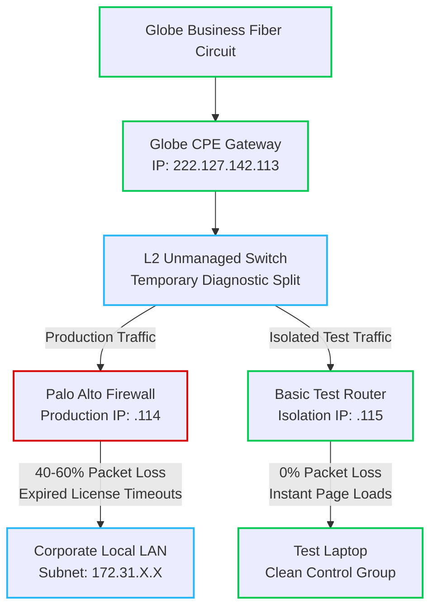

# Network Diagnostic Report: Outbound Latency & Packet Loss Investigation

**Date:** June 10, 2026  
**Prepared By:** Network Administration Team  
**Location Under Investigation:** Rawis Office (Branch)  
**Affected Sites:** Rawis Office, Buraguis Office  
**Unaffected Sites:** Embarcadero Office  
**Target Services:** Google Services (Drive/Search), Yahoo, and General Outbound Web Traffic  

---

## 1. Executive Summary
Users at the Rawis and Buraguis offices have reported significant delays when loading web applications (e.g., Google Drive) and refreshing browsers. Initial diagnostics showed an alarming **40% to 60% packet loss** when pinging public targets like `google.com` and `yahoo.com`. 

A cross-site comparison revealed that the Embarcadero office (running on a **Ruijie gateway**) experiences **0% packet loss**, while Rawis and Buraguis (both running **Palo Alto firewalls with expired security licenses**) suffer severe degradation. Testing confirms that the Globe Business ISP circuit is healthy; the root cause is a processing bottleneck on the Palo Alto firewalls due to expired cloud-security subscription timeouts. 

---

## 2. Infrastructure Flow & Troubleshooting Topology
The diagram below illustrates the current routing architecture and the temporary demarcation setup designed to isolate the root cause.

---

## 3. Technical Evidence & Test Results

### Test A: Internal Hop & CPE Gateway Isolation
To isolate whether the issue was local network hardware (cables, switches) or the ISP handoff, a 100-packet continuous ping was executed directly to the Globe Customer Premises Equipment (CPE) gateway.
*   **Internal Core IP (`172.31.95.254`):** Stable latency (2ms), **0% packet loss**.
*   **Globe CPE Gateway LAN IP (`222.127.142.113`):** Stable latency (5ms), **0% packet loss**.
*   **Diagnostic Verdict:** The local LAN infrastructure, internal switches, patch cables, and physical connectivity up to the Globe perimeter are **100% healthy**.

### Test B: Transport Layer Testing (`curl`)
A transport-layer test was conducted using `curl -Iv https://google.com` to observe real production web traffic (TCP Port 443).
*   **Result:** Connection was successfully established, SSL/TLS handshake completed, and an `HTTP 301` response was received immediately. 
*   **Diagnostic Verdict:** The underlying physical bandwidth provided by Globe Business is active. However, real users experience delays because `curl` tests a single, pre-cached, direct stream, whereas standard browsers spawn dozens of simultaneous tracking, script, and database queries that overwhelm the local firewall.

### Test C: ICMP Ping & `tracert` to External Targets
Continuous pings (`ping -t`) and traceroutes were sent to high-availability external nodes (`google.com`, `yahoo.com`).
*   **Result:** Packet loss spiked between **40% and 60%**, accompanied by erratic `"Request timed out"` asterisks (`*`) across external hops.
*   **Diagnostic Verdict:** Traffic successfully exits the local network but gets dropped or delayed during the session-creation phase.

---

## 4. Cross-Site Comparative Analysis
To definitively isolate the variable causing the issue, network metrics were compared across three company offices, all utilizing Globe Business circuits:

| Office Location | Gateway Appliance | Security License Status | Observed Packet Loss % | Google Drive / Web Performance |
| :--- | :--- | :--- | :--- | :--- |
| **Embarcadero** | Ruijie Gateway | Active / Clean | **~0% Loss** | Fast / Normal |
| **Rawis (Local)** | Palo Alto | **EXPIRED** | **40% - 60% Loss** | Severe Initial Delay / Lagging |
| **Buraguis** | Palo Alto | **EXPIRED** | **40% - 60% Loss** | Severe Initial Delay / Lagging |

**Conclusion:** The issue strictly isolates to branches utilizing Palo Alto security appliances with lapsed subscriptions.

---

## 5. Root Cause Analysis: Expired Palo Alto Licenses
The Central Office confirmed that the following security subscriptions on the Palo Alto appliances have expired:
*   Advanced DNS Security & Threat Prevention
*   Advanced URL Filtering & PAN-DB URL Filtering
*   Premium Support & SD-WAN
*   Advanced Wildfire License

### The Technical Mechanism of the Bottleneck
Palo Alto firewalls utilize "Fail-Open" logic for expired cloud subscriptions, meaning they will not completely block the internet. However, the firewall engines do not stop scanning. 

Every time a user opens a browser, refreshes a page, or connects to Google Drive, the firewall attempts to query Palo Alto’s cloud verification servers for URL categorization, DNS safety, and Wildfire file sandboxing. Because the licenses are expired, the cloud database rejects or ignores the queries. 

The firewall's data plane is forced to wait for an **internal software lookup timeout (typically 2 to 5 seconds per request)** before letting the packet pass. When hundreds of browser elements hit these timeout loops simultaneously, the firewall's processing buffers overflow, causing it to **discard excess traffic—resulting in the observed 40%–60% packet loss and initial browser lagging.**

---

## 6. Next Steps & Demarcation Troubleshooting Plan

To provide undeniable, physical proof to senior management and the security infrastructure team, the local network administration will execute a **Demarcation Isolation Test** using the following methodology:

1.  **Deploy an Unmanaged Switch:** Place a Layer 2 unmanaged switch directly on the handoff port of the Globe CPE Gateway.
2.  **Maintain Production:** Keep the current production network running on the firewall's assigned public IP (`.114`).
3.  **Establish a Control Group:** Connect a basic, unmanaged home/test router to the unmanaged switch using one of the other 5 available public IPs allocated by Globe (e.g., statically assigning `.115` through `.118` using the `.113` gateway).
4.  **Verify Metrics:** Connect a test laptop directly to the test router, bypassing the Palo Alto firewall entirely. 

If the test laptop experiences 0% packet loss and loads Google Drive instantly, the case will be formally closed as a **Local Security Appliance Software Bottleneck**, and the definitive solution will require the Central Office to either renew the Palo Alto subscriptions or temporarily disable the expired security profiles within the firewall's policy rules.
